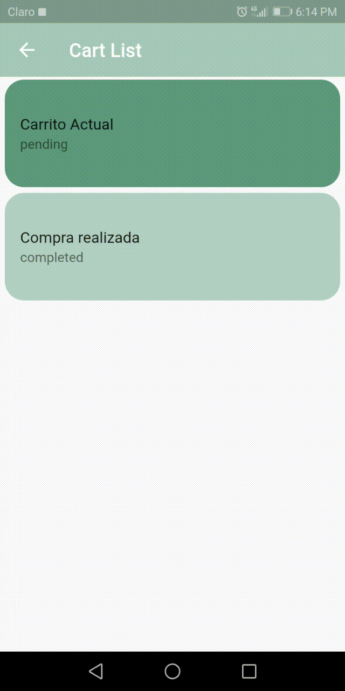
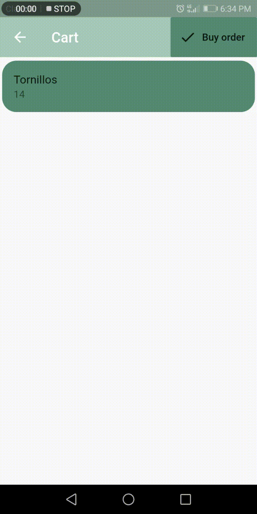

# tul_entry_app

Esta es la prueba tecnica para el puesto desarrollador Flutter en Tül

La aplicación es un carrito de compras que permite seleccionar un producto en el homePage
y agregarlo a un carrito en donde se puede eliminar o editar la cantidades que se quiere comprar.

Para agregar otro producto se hace desde el Homepage, este se agrega en el carrito actual mientras este aun siga en estado pending

cuando se haga la compra el carrito cambia de estado evitando que se editen los productos comprados o que se eliminen. Y si se quiere comprar mas productos, se hace la misma forma; la app crea un carrito nuevo y empieza una nueva lista.

La aplicacion consta de las siguientes pantallas:

## Home Page

En esta pantalla se encuentran todos los productos, y los botones para
acceder al carrito.

## Cart List Page

En esta pantalla se pueden visualizar el carrito de compras actual y los carritos que ya pasaron a estado de completado

## Cart Page
En esta pantalla se observan los productos que estan dentro del carrito, cada Tile del producto esta creada apartir de in Dissmisible, el cual permite eliminar el elemento del carrito al hacer slide. A su vez al dar tap en cada elemento se puede editar la cantidad productos que se van a agregar.

Para comprar un producto, se presiona da tap en la parte superior de la pagina del carrito, esto hace que su estado cambie de pending a completed. Una bez hecho esto, los elementos del carrito no pueden ser ni editados ni eliminados. Y la proxima compra que se haga crea un carrito nuevo.

BORRAR UN PRODUCTO

ACTUALIZAR UN PRODUCTO

## Estructura del proyecto

El archivo esta organizado de la siguiente manera dentro de lib

-main.dart: definición de rutas y codigo principal de la app

-src/blocs: Contiene los bloc usandos a largo de la app y el provider que los gestiona

-src/models: Contiene los modelos de producto, carrito y porductosEnCarrito junto a las funciones
             para convertir a json.

-src/pages: Contiene las Views o pantallas de la aplicacion

-src/providers: Contiene las funciones que hacen los llamados http a la base de datos en tiempo
                real de firebase

-src/widgets: Contiene widgets separados en clases usados a lo largo de las views

## Base de datos

La base de datos se realizó en firebase, y tiene tres ramas que almacena los siguientes elementos:

-Carritos: Contiene un id, y un status

-Producto: Contienen una descripción, un nombre y un codigo SKU

-ProductoEnCarrito: Contiene el id de carrito al que pertenece, el id de producto que se encuentra en     la tabla Producto y la cantidad de unidades

La conexión a a la base de datos se hace a través de request http definidas en src/providers

## Getting Started

This project is a starting point for a Flutter application.

A few resources to get you started if this is your first Flutter project:

- [Lab: Write your first Flutter app](https://flutter.dev/docs/get-started/codelab)
- [Cookbook: Useful Flutter samples](https://flutter.dev/docs/cookbook)

For help getting started with Flutter, view our
[online documentation](https://flutter.dev/docs), which offers tutorials,
samples, guidance on mobile development, and a full API reference.
