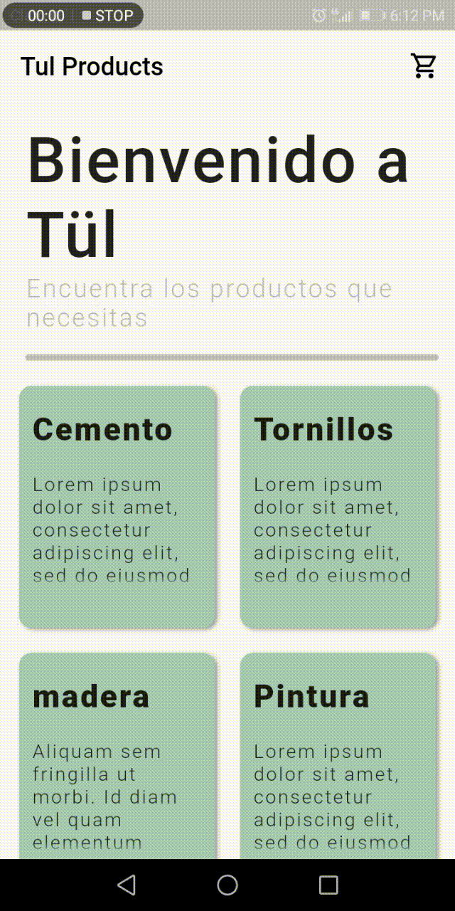

# tul_entry_app

Esta es la prueba tecnica para el puesto desarrollador Flutter en Tül

La aplicacion consta de las siguientes pantallas:

## Home Page

En esta pantalla se encuentran todos los productos, y los botones para
acceder al carrito.

## Cart List Page

En esta pantalla se pueden visualizar el carrito de compras actual y los carritos que ya pasaron de un estado de completado.

## Cart Page
En esta pantalla se observan los productos que estan dentro del carrito, cada Tile del producto esta creada apartir de in Dissmisible, el cual permite eliminar el elemento del carrito al hacer slide. A su vez al dar tap en cada elemento se puede editar la cantidad productos que se van a agregar.

## Getting Started

This project is a starting point for a Flutter application.

A few resources to get you started if this is your first Flutter project:

- [Lab: Write your first Flutter app](https://flutter.dev/docs/get-started/codelab)
- [Cookbook: Useful Flutter samples](https://flutter.dev/docs/cookbook)

For help getting started with Flutter, view our
[online documentation](https://flutter.dev/docs), which offers tutorials,
samples, guidance on mobile development, and a full API reference.
